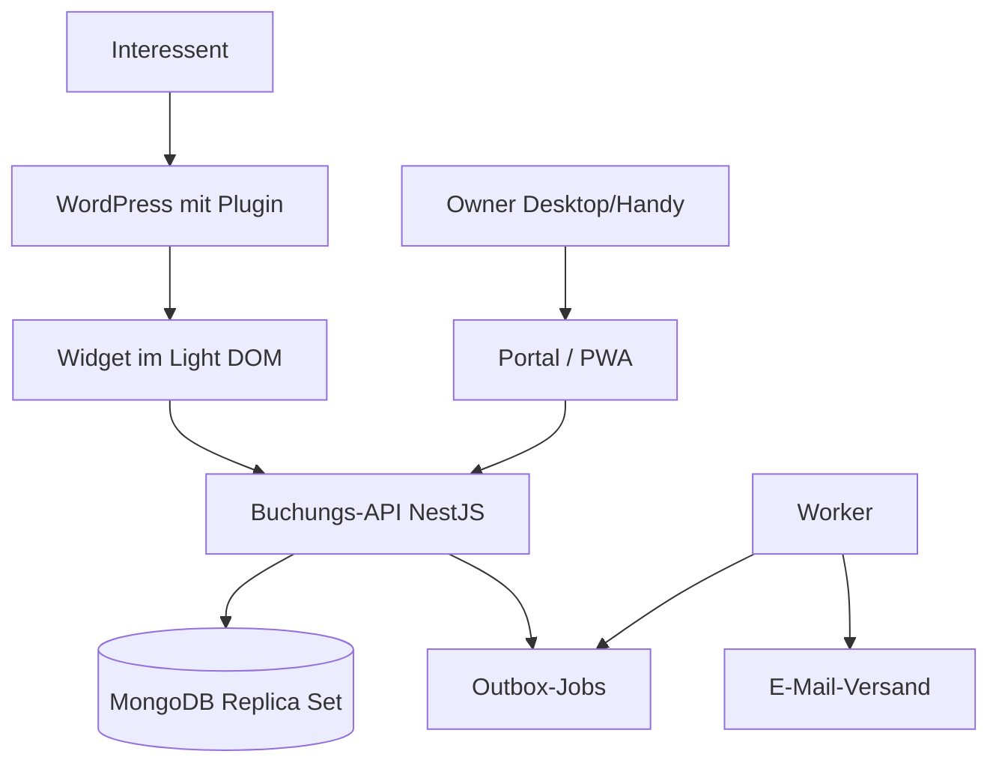

# Architektur

Eigenständige Buchungsanwendung mit API und MongoDB. WordPress bindet nur das öffentliche Widget ein; Owner arbeiten in einem eigenen Verwaltungsportal, das zugleich als PWA installierbar ist. Je Kunde eine getrennte Installation mit eigener Datenbank, gemeinsamer versionierter Code.



## Repository-Struktur

```
apps/api          Buchungsregeln, Auth, REST
apps/worker       Outbox, Leases, E-Mail
apps/portal       Owner-Portal und PWA
packages/db       Datenmodell, Collections, Migrationen (API und Worker)
packages/shared   Domänentypen, Validierung, Zeitzonen
packages/widget   Öffentliches Widget
plugins/wordpress PHP-Plugin
infra/            docker-compose (MongoDB, Mailpit)
```

## Terminarten

| | Einzeltermin | Gruppenkurs |
|---|---|---|
| Owner pflegt | Öffnungszeiten, Ausnahmen, Dauer (inkl. eventuellem Puffer) | Kurstermine bzw. wiederkehrende Regeln mit Kapazität |
| Interessent sieht | Tag → freie Uhrzeiten | Kurstermine mit freien Plätzen |
| Kapazität | 1 | > 1 |
| Schutz vor Doppelbuchung | Belegungseinheiten der Ressource mit eindeutigem Index | Atomare Kapazitätsprüfung in der Schreibbedingung |

Kurse blockieren die Ressource ebenfalls, sodass Einzeltermine sich nicht mit Kursen überschneiden.

## Collections

`settings`, `owners`, `services`, `openingHours`, `availabilityExceptions`, `courseRules`, `sessions`, `bookings`, `resourceOccupancy`, `actionTokens`, `outboxJobs`, `auditEvents` sowie `_migrations` für angewendete Migrationen.

Dokumenttypen und Collection-Zugriffe: `packages/db/src/documents.ts` (Paket `@fw-booking/db`, von API und Worker genutzt; `apps/api/src/database/documents.ts` re-exportiert es). Zeitpunkte sind BSON-Dates in UTC. Struktur, Validatoren und Indizes entstehen über versionierte Migrationen in `packages/db/src/migrations/` und werden mit `pnpm --filter @fw-booking/api db:migrate` angewendet (nicht beim API- oder Worker-Start).

| Schutz | Umsetzung |
|---|---|
| Keine Doppelbelegung der Ressource | Eindeutiger Index `resourceOccupancy(resourceId, unitStart)`; Validator erzwingt 5-Minuten-Raster |
| Keine Überbuchung eines Kurses | Validator `bookedCount ≤ capacity` auf `sessions` |
| Keine doppelte Buchung bei Wiederholung | Eindeutiger Index `bookings(idempotencyKey)` |
| Eine aktive Buchung je E-Mail und Kurstermin | Eindeutiger Teilindex `bookings(sessionId, participantEmailKey)` für `status: confirmed` |
| Idempotente Kurstermin-Erzeugung | Eindeutiger Teilindex `sessions(ruleId, localStart)` |
| Tokens nur als Hash | Validator verlangt SHA-256-Hex in `actionTokens.tokenHash` |

## Owner-Anmeldung

| Endpunkt | Wirkung |
|---|---|
| `POST /api/auth/login` | Prüft E-Mail und Passwort (Argon2id), legt Sitzung an, setzt Cookie, liefert CSRF-Token |
| `GET /api/auth/session` | Aktuelle Sitzung mit CSRF-Token oder 401 |
| `POST /api/auth/logout` | Löscht Sitzung und Cookie |

- **Standardmäßig gesperrt:** Ein globaler Guard verlangt für jede Route eine Owner-Sitzung; öffentliche Routen werden mit `@Public()` freigegeben.
- **Sitzung:** Zufallstoken (256 Bit) im Cookie `__Host-fw_session` (lokal `fw_session`), `HttpOnly`, `Secure`, `SameSite=Lax`. In `authSessions` liegt nur der SHA-256-Hash. 12 h Inaktivität, maximal 7 Tage; neue Sitzung bei jedem Login.
- **CSRF:** Ändernde Anfragen brauchen `Content-Type: application/json` und den Header `X-CSRF-Token` der Sitzung.
- **Passwort-Raten:** Nach 5 Fehlversuchen in 15 Minuten je E-Mail oder IP antwortet der Login mit 429. Unbekannte E-Mails und falsche Passwörter sind von außen nicht unterscheidbar.
- **Konten:** Keine Selbstregistrierung; Anlage per `owner:create` (Passwort ≥ 12 Zeichen, verdeckte Eingabe).

## Missbrauchsschutz und CORS

`apps/api/src/security/` bündelt den Schutz der öffentlichen API. Die Reihenfolge in `app.factory.ts`: CORS-Prüfung, JSON-Parser, Parserfehler, Cookies, Routen.

- **CORS:** Nur Origins aus `CORS_ALLOWED_ORIGINS` (exakte Origins der WordPress-Seiten, kommagetrennt) erhalten für `/api/public/*` die Header `Access-Control-Allow-Origin`, `Vary: Origin` und bei Preflights `GET, POST`, `Content-Type, X-Booking-Token`, 10 Minuten Cache; keine Credentials. Anfragen mit fremdem `Origin` (auch `null`) beantwortet die API mit 403 `origin_not_allowed`, bevor der Body gelesen wird, sodass sie keine Buchung auslösen. Anfragen ohne `Origin` (Server, curl) sind nicht betroffen. Owner-Routen erhalten keine CORS-Freigabe.
- **Ratenbegrenzung:** `RateLimitGuard` zählt je Client-IP (IPv6 je /64, Client-IP über `TRUST_PROXY`) in festen Fenstern im Speicher der API. Öffentliche Routen fallen standardmäßig unter `read`; `@RateLimit(...)` ordnet zu, `@SkipRateLimit()` nimmt den Healthcheck aus. Owner-Routen sind nicht begrenzt (Login-Schutz siehe oben). Überschreitung: 429 `rate_limited` mit `Retry-After`.

| Grenze | Routen | Standard (Variable) |
|---|---|---|
| `read` | Angebote, Slots, Tage, Kurstermine, Login | 120 je Minute (`RATE_LIMIT_READ`) |
| `booking` | `POST …/bookings` | 10 je 10 Minuten (`RATE_LIMIT_BOOKING`) |
| `manageRead` | Verwaltungslink: Ansicht, mögliche Termine | 60 je Minute (`RATE_LIMIT_MANAGE_READ`) |
| `manageWrite` | Verwaltungslink: Storno, Umbuchung | 10 je 10 Minuten (`RATE_LIMIT_MANAGE_WRITE`) |
| je E-Mail | neue Buchungen derselben Adresse | 5 je Stunde (`BOOKING_LIMIT_PER_EMAIL`) |

  `0` schaltet eine Grenze ab (Tests). Das Limit je E-Mail zählt in `BookingService` die Buchungen der letzten Stunde (Index `participantEmailKey_createdAt`, Migration `007`); Wiederholungen mit gleichem Idempotenzschlüssel und Umbuchungen zählen nicht. Überschreitung: 429 `too_many_bookings`. Bei gleichzeitigen Anfragen derselben Adresse kann es knapp überschritten werden.
- **Eingaben:** Eigener JSON-Parser mit 16 KB Limit; fehlerhaftes JSON ergibt 400 „Ungültige Eingabe“, zu große Anfragen 413, jeweils ohne Parsermeldung. Zod-Fehler nennen nur Feldpfad und Regel, nie Werte. Unbekannte Routen ergeben 404 „Nicht gefunden“ ohne Methode und Pfad.

## Owner-API: Angebote

| Endpunkt | Wirkung |
|---|---|
| `GET /api/owner/services[?active=true\|false]` | Angebote in manueller Reihenfolge |
| `GET /api/owner/services/:id` | Ein Angebot |
| `POST /api/owner/services` | Anlegen (`serviceCreateSchema`), neues Angebot ans Ende |
| `PATCH /api/owner/services/:id` | Teiländerung (`serviceUpdateSchema`), auch Deaktivieren über `active`; Wechsel der Terminart → 409 |
| `PUT /api/owner/services/order` | Reihenfolge aller Angebote (`serviceOrderUpdateSchema`) |

## Owner-API: Öffnungszeiten und Ausnahmen

| Endpunkt | Wirkung |
|---|---|
| `GET /api/owner/opening-hours` | Wochenplan und (nur lesbar) Zeitzone der Installation |
| `PUT /api/owner/opening-hours` | Ersetzt den ganzen Wochenplan (Transaktion) |
| `GET /api/owner/availability-exceptions[?from&to]` | Ausnahmen, die den Zeitraum berühren; Standard ab heute |
| `POST /api/owner/availability-exceptions` | Sperrzeit oder zusätzliche Öffnung; Antwort nennt betroffene bestätigte Buchungen |
| `DELETE /api/owner/availability-exceptions/:id` | Ausnahme entfernen |

`AvailabilityService.openWindowsForDate(datum)` liefert die geöffneten UTC-Fenster eines lokalen Tages: (Wochenplan ∪ zusätzliche Öffnungen) − Sperrzeiten, begrenzt auf den Tag. Darauf baut die Slot-Berechnung auf.

## Slot-Berechnung

`SlotService.slotsForDate(angebot, datum, jetzt)` berechnet freie Einzeltermin-Slots aus den geöffneten Fenstern (`openWindowsForDate`), jeder Startzeit im 5-Minuten-Raster in lokaler Zeit, der Dauer, den belegten 5-Minuten-Einheiten in `resourceOccupancy` (einzige Quelle für Belegungen durch Einzeltermine und Kurse) sowie Mindestvorlauf und Horizont. `availableDates(angebot, von, bis)` nennt Tage mit mindestens einem freien Slot (höchstens 62 Tage).

| Endpunkt | Wirkung |
|---|---|
| `GET /api/owner/services/:id/slots?date=` | Vorschau der freien Slots (Format wie öffentliche API) |
| `GET /api/owner/services/:id/available-dates?from=&to=` | Tage mit freien Slots |

## Owner-API: Kurstermine und Kursregeln

| Endpunkt | Wirkung |
|---|---|
| `GET /api/owner/sessions[?from&to&serviceId&includeCancelled]` | Kurstermine mit Belegung |
| `POST /api/owner/sessions` | Einzelnen Kurstermin anlegen (Belegung der Ressource in derselben Transaktion) |
| `PATCH /api/owner/sessions/:id` | Kapazität (≥ gebuchte Plätze), Ort, Sperren; Uhrzeit nur ohne Buchungen |
| `DELETE /api/owner/sessions/:id` | Nur ohne Buchungshistorie |
| `GET/POST /api/owner/course-rules`, `GET/PATCH/DELETE /api/owner/course-rules/:id` | Kursregeln; Anlegen und Ändern erzeugen Termine und liefern einen Bericht (erzeugt, Konflikte, unverändert gebuchte) |

`CourseRulesService.generateForRule` erzeugt fehlende Termine idempotent über den eindeutigen Index `sessions(ruleId, localStart)`. `localStart` ist bei Regelterminen der Wiederholungsschlüssel und bleibt beim Verschieben erhalten. `CourseGenerationScheduler` ruft die Erzeugung beim Start und alle 6 Stunden auf.

## Owner-API: Buchungen, Teilnehmer und Absagen

Alle Antworten enthalten Teilnehmerdaten und tragen `Cache-Control: no-store`.

| Endpunkt | Wirkung |
|---|---|
| `GET /api/owner/bookings[?from&to&serviceId&sessionId&status]` | Buchungen beider Terminarten; ohne Zeitraum 31 Tage ab heute, höchstens 92 Tage |
| `GET /api/owner/bookings/:id` | Einzelne Buchung |
| `POST /api/owner/bookings/:id/cancel` `{ confirm: true, reason? }` | Einzelne Buchung absagen |
| `GET /api/owner/sessions/:id/participants` | Kurstermin mit allen Buchungen (jeder Status), älteste zuerst |
| `POST /api/owner/sessions/:id/cancel` `{ confirm: true, reason? }` | Kurstermin samt aller bestätigten Buchungen absagen |

`OwnerBookingsService` führt jede Absage in einer Transaktion aus: Status `cancelled_by_owner` (Termin `cancelled`, `bookedCount` 0), Freigabe von Kursplatz, Zeit bzw. Ressourcenbelegung, Entwertung aller Links (`revoked`), je Buchung ein Outbox-Auftrag `owner_cancellation` und Audit (`booking.cancelled_by_owner`, `session.cancelled`, ohne Begründung). Die optionale Begründung steht in `ownerCancellationReason` bzw. `cancellationReason`. Wiederholte Absagen liefern `alreadyCancelled: true`; nicht aktive Buchungen 409 `not_cancellable`, beendete Termine 409 `appointment_ended`.

## Öffentliche API (Widget)

Ohne Anmeldung, je öffentlicher Kalenderkennung (`cal_…`, eine je Installation, Migration `004`; für den Owner über `GET /api/owner/calendar`).

| Endpunkt | Inhalt | Cache |
|---|---|---|
| `GET /api/public/calendars/:calendarId/services` | Aktive Angebote in Reihenfolge | 5 Min |
| `GET …/services/:serviceId/slots?date=` | Freie Einzeltermin-Slots; belegte Zeiten erscheinen nicht | 30 s |
| `GET …/services/:serviceId/available-dates?from=&to=` | Tage mit freien Slots (≤ 62 Tage) | 30 s |
| `GET …/services/:serviceId/sessions?from=&to=` | Geplante Kurstermine mit freien Plätzen, ausgebuchte mit 0 (≤ 62 Tage) | 30 s |

Unbekannte Kalender sowie unbekannte oder deaktivierte Angebote ergeben 404. Jede Antwort wird vor dem Senden gegen das strikte Schema aus `@fw-booking/shared` geprüft (`assertPublic`); zusätzliche Felder wie Teilnehmerdaten verhindern die Auslieferung.

## Öffentliche Buchung

`POST /api/public/calendars/:calendarId/bookings` (ohne Anmeldung, JSON, `bookingRequestSchema`). Kursbuchungen laufen in einer Transaktion: Platz per Schreibbedingung `bookedCount < capacity` belegen, Buchung, Outbox-Auftrag `booking_confirmation` und Audit-Eintrag anlegen. Wiederholte Anfragen mit gleichem Idempotenzschlüssel liefern 200 mit derselben Buchung; abweichende Daten 409. Einzeltermine (`type: 'single'`) sind nur zu berechneten Startzeiten buchbar; die Transaktion belegt die 5-Minuten-Einheiten der Dauer in `resourceOccupancy`, der eindeutige Index verhindert Überschneidungen mit anderen Einzelterminen und Kursen. Kurs- und Einzelbuchung teilen Idempotenz, Outbox, Audit und Fehlerbehandlung. Fehler tragen einen Code (`session_full`, `slot_taken`, `not_bookable`, `already_booked`, `idempotency_conflict`).

## Selbstverwaltung über den Verwaltungslink

| Endpunkt | Wirkung |
|---|---|
| `GET /api/public/manage` (Header `X-Booking-Token`) | Ansicht der eigenen Buchung (ohne E-Mail und Telefon), Frist und erlaubte Aktionen |
| `GET /api/public/manage/slots?date=` bzw. `/sessions?from=&to=` | Mögliche neue Termine desselben Angebots (eigene Zeit gilt als frei) |
| `POST /api/public/manage/rebook` `{ type, startsAt \| sessionId, confirm: true }` | Umbuchung in einer Transaktion: alte Buchung `rebooked`, neue Buchung, Platz/Zeit verschieben, Links übertragen, Auftrag `booking_rebooked`, Audit; höchstens einmal |
| `POST /api/public/manage/cancel` `{ confirm: true }` | Storno in einer Transaktion: Status, Freigabe von Kursplatz bzw. Belegungseinheiten, Entwertung aller Links, Outbox-Auftrag `booking_cancellation`, Audit |

`ActionTokenService.issue` erzeugt Links (für den Mail-Worker ab task-3-2); unbekannte Tokens ergeben 404, abgelaufene 410 (`link_expired`), überschrittene Frist 409 (`change_deadline_passed`). Antworten tragen `Cache-Control: no-store` und `Referrer-Policy: no-referrer`.

## Hintergrund-Worker

`apps/worker` ist ein eigener Node.js-Prozess (ohne NestJS) und arbeitet `outboxJobs` ab. Start: `pnpm --filter @fw-booking/worker dev` bzw. nach `pnpm build` `start`; Konfiguration aus derselben `.env` (`MONGODB_URI`, `LOG_LEVEL`, `WORKER_CONCURRENCY` Standard 4, `WORKER_POLL_INTERVAL_MS` Standard 5000).

- **Beanspruchen:** `JobQueue.claim` holt per `findOneAndUpdate` den ältesten fälligen Job eines Typs mit registriertem Handler – `pending` mit `dueAt ≤ jetzt` oder `processing` mit abgelaufener Lease – und setzt `processing`, `leaseUntil` (+5 Minuten), ein zufälliges `leaseToken` und `attempts + 1`. Mehrere Worker erhalten so nie denselben Job gleichzeitig.
- **Ergebnis:** `complete` (`sent`, `completedAt`) und `fail` schreiben nur, wenn `leaseToken` noch passt; ein Worker mit abgelaufener, neu vergebener Lease kann nichts überschreiben.
- **Wiederholungen:** Handler werfen `temporaryFailure(kategorie)` (Wiederholung) oder `permanentFailure(kategorie)` (sofort `failed`); unbekannte Fehler gelten als vorübergehend (`unexpected`). Abstände nach Versuch 1–5: 1, 5, 15, 60, 180 Minuten (±10 %), nach 6 Versuchen `failed` mit `failedAt`. Gespeichert wird nur `lastErrorCategory`, nie die Fehlermeldung. Ein Job, dessen Lease nach dem letzten Versuch abgelaufen ist, wird ohne erneute Ausführung `failed` (`lease_expired`).
- **Zeitlimit:** Handler laufen höchstens 4 Minuten (unter der Lease) und erhalten ein `AbortSignal`; Überschreitung zählt als vorübergehender Fehler `timeout`.
- **Zustellung mindestens einmal:** Stürzt ein Worker nach dem Versand, aber vor `complete` ab, wird der Job nach Ablauf der Lease erneut ausgeführt. Mails tragen deshalb eine stabile Message-ID je Job (`<jobId.typ@absenderdomain>`).
- **Handler:** `src/handlers/index.ts` ordnet Jobtypen Handler zu; Handler liefern `sent` oder `skipped` (gespeichert in `result`). Nur registrierte Typen werden beansprucht, andere bleiben unverändert `pending` (derzeit `booking_reminder` bis task-3-4).

## E-Mail-Versand

SMTP über `nodemailer` (`src/mail/mailer.ts`); lokal Mailpit (`SMTP_HOST=127.0.0.1`, `SMTP_PORT=1025`, Oberfläche http://127.0.0.1:8025). In Produktion ist eine verschlüsselte Verbindung Pflicht (STARTTLS oder `SMTP_SECURE=true`). Absender und Kontakt je Installation aus Umgebungsvariablen: `MAIL_FROM_ADDRESS` (Anzeigename `BUSINESS_NAME`), optional `MAIL_REPLY_TO`, `BUSINESS_PHONE`, `SMTP_USER`/`SMTP_PASSWORD`. Der Verwaltungslink lautet `MANAGE_PAGE_URL#t=TOKEN` (WordPress-Seite mit Widget, in Produktion nur https); optional verlinken Storno- und Absagemail `BOOKING_PAGE_URL` zum erneuten Buchen.

| SMTP-Fehler | Kategorie | Folge |
|---|---|---|
| Verbindung, DNS, Zeitüberschreitung | `smtp_unavailable` | Wiederholung |
| Anmeldung fehlgeschlagen | `smtp_auth` | Wiederholung (Betreiber kann Zugangsdaten korrigieren) |
| 4xx | `smtp_deferred` | Wiederholung |
| 5xx beim Empfänger (`RCPT TO`) | `recipient_rejected` | sofort `failed` |
| 5xx sonst | `message_rejected` | sofort `failed` |

**Bestätigungsmail** (`booking_confirmation`, `src/handlers/booking-confirmation.ts`): lädt Buchung, Angebot, Kurstermin (Ort) und Einstellungen; ist die Buchung nicht mehr `confirmed`, wird der Job ohne Mail mit `result: 'skipped'` abgeschlossen, fehlt sie, endet er als `booking_missing`. Sonst stellt der Handler über `issueActionToken` (`@fw-booking/db`, gemeinsam mit der API) einen neuen Link aus und versendet Text, HTML und `termin.ics`: Angebot, Datum und Uhrzeit in der Zeitzone der Installation, Ort, Änderungsfrist (Angebot bzw. Installation), Link sowie Kontakt. Nach Ablauf der Frist weist die Mail auf den direkten Kontakt hin. Scheitert der Versand, wird der eben ausgestellte Token wieder gelöscht. Alle Werte werden im HTML maskiert; die Kalenderdatei enthält keinen Verwaltungslink. Logs enthalten nur Job-ID, Typ, Versuch und Kategorie.

**Storno-, Umbuchungs- und Absagemail** (`src/handlers/booking-changes.ts`, Inhalte in `src/mail/changes.ts`; alle Mails teilen das Gerüst `src/mail/layout.ts`):

| Auftrag | Bezug | Versand nur bei Status | Inhalt | Kalenderdatei |
|---|---|---|---|---|
| `booking_cancellation` | stornierte Buchung | `cancelled` | Bestätigung des Stornos, kein Verwaltungslink (alle Links entwertet), optional Link zum erneuten Buchen | `STATUS:CANCELLED` |
| `booking_rebooked` | neue Buchung | `confirmed` | bisheriger und neuer Termin, neue Frist, neuer Verwaltungslink (nur noch Storno möglich), Hinweis auf weiter gültige Links | neue Zeit |
| `owner_cancellation` | abgesagte Buchung (je Teilnehmer ein Auftrag) | `cancelled_by_owner` | Absage mit optionaler Begründung, Entschuldigung, Kontakt, optional Link zum erneuten Buchen | `STATUS:CANCELLED` |

Trägt die Buchung einen anderen Status, wird der Auftrag ohne Mail mit `result: 'skipped'` abgeschlossen (z. B. Umbuchungsmail, wenn die neue Buchung bereits wieder storniert ist). Die Kalenderdatei verwendet immer die UID der ersten Buchung der Umbuchungskette (`booking-<id>@absenderdomain`) mit steigender `SEQUENCE` (Bestätigung 0, Umbuchung 1, Absage +1), damit Kalender-Apps den vorhandenen Eintrag verschieben bzw. als abgesagt markieren. **Deduplizierung:** je Buchung und Anlass höchstens ein Auftrag (eindeutiger `dedupeKey`), ein erledigter Auftrag wird nicht erneut beansprucht, und eine nach Absturz wiederholte Mail trägt dieselbe Message-ID.
- **Herunterfahren:** SIGTERM/SIGINT beenden das Abfragen; laufende Jobs werden abgeschlossen, danach endet der Prozess.
- **Aufbewahrung:** Versendete Jobs löscht ein TTL-Index 30 Tage nach `completedAt` (Migration `008`, nur `status: 'sent'`); `failed` bleibt für die Anzeige im Portal. Index `status_leaseUntil` für abgelaufene Leases.

## Nebenläufigkeitstests

`apps/api/src/concurrency/` prüft gegen ein echtes Replica Set sieben Szenarien: Kurs mit N Plätzen (inkl. Doppelklicks), Kapazität senken während gebucht wird, Kurstermin sperren während gebucht wird, Kurstermin absagen während gebucht wird, Kurstermin anlegen gegen Einzelbuchung zur selben Zeit, Erzeugung aus Kursregeln gegen Einzelbuchungen, überlappende Einzelbuchungen mehrerer Angebote. Nach jedem Durchlauf prüft `checkConsistency` die Invarianten (bookedCount = bestätigte Buchungen ≤ Kapazität, Einzelbuchungen belegen genau ihre Dauer, keine verwaisten oder doppelten Belegungen, genau ein Bestätigungsauftrag je Buchung, genau ein Absageauftrag je vom Owner abgesagter Buchung). Normallauf: 50 Anfragen, ein Durchlauf; Lastlauf `test:concurrency`: 200 Anfragen, 20 Durchläufe, Log in `apps/api/logs/`. Der Testclient nutzt höchstens 64 Verbindungen (macOS begrenzt die Verbindungs-Warteschlange auf 128); alle Anfragen werden dennoch gleichzeitig abgeschickt.

## Zentrale Abnahmetests

- Parallele Anfragen auf denselben Einzeltermin-Slot → genau eine Buchung.
- Kurs mit N Plätzen → bei parallelen Anfragen genau N Buchungen.
- Gleicher Idempotenzschlüssel → keine zweite Buchung.
- Mehrfaches Storno gibt Plätze nur einmal frei; fehlgeschlagene Umbuchung erhält die ursprüngliche Buchung.
- Längere Einzeltermine blockieren alle überlappenden Slots, auch anderer Angebote; Kurse blockieren Einzeltermine.
- Sommer-/Winterzeit wird korrekt behandelt.
- Ausfall des E-Mail-Dienstes verliert keine Buchung.
- Nach Logout keine Teilnehmerdaten abrufbar oder im Service-Worker-Cache.
- Zugangsdaten einer Installation eröffnen keinen Zugriff auf eine andere.
- Backups lassen sich wiederherstellen.

Ausführliche Herleitung: `Architektur-Terminbuchung.md` (Ausgangsdokument außerhalb des Repositorys).
