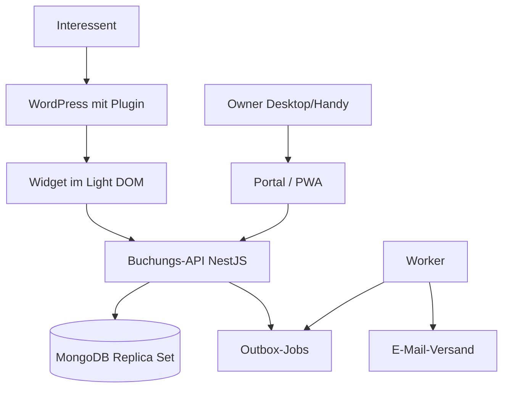

# Architektur

Eigenständige Buchungsanwendung mit API und MongoDB. WordPress bindet nur das öffentliche Widget ein; Owner arbeiten in einem eigenen Verwaltungsportal, das zugleich als PWA installierbar ist. Je Kunde eine getrennte Installation mit eigener Datenbank, gemeinsamer versionierter Code.



## Repository-Struktur

```
apps/api          Buchungsregeln, Auth, REST
apps/worker       Outbox, Leases, E-Mail
apps/portal       Owner-Portal und PWA
packages/shared   Domänentypen, Validierung, Zeitzonen
packages/widget   Öffentliches Widget
plugins/wordpress PHP-Plugin
infra/            docker-compose (MongoDB, Mailpit)
```

## Terminarten

| | Einzeltermin | Gruppenkurs |
|---|---|---|
| Owner pflegt | Öffnungszeiten, Ausnahmen, Dauer (inkl. eventuellem Puffer) | Kurstermine bzw. wiederkehrende Regeln mit Kapazität |
| Interessent sieht | Tag → freie Uhrzeiten | Kurstermine mit freien Plätzen |
| Kapazität | 1 | > 1 |
| Schutz vor Doppelbuchung | Belegungseinheiten der Ressource mit eindeutigem Index | Atomare Kapazitätsprüfung in der Schreibbedingung |

Kurse blockieren die Ressource ebenfalls, sodass Einzeltermine sich nicht mit Kursen überschneiden.

## Collections

`settings`, `owners`, `services`, `openingHours`, `availabilityExceptions`, `courseRules`, `sessions`, `bookings`, `resourceOccupancy`, `actionTokens`, `outboxJobs`, `auditEvents` sowie `_migrations` für angewendete Migrationen.

Dokumenttypen: `apps/api/src/database/documents.ts`. Zeitpunkte sind BSON-Dates in UTC. Struktur, Validatoren und Indizes entstehen über versionierte Migrationen in `apps/api/src/database/migrations/` und werden mit `pnpm --filter @fw-booking/api db:migrate` angewendet (nicht beim API-Start).

| Schutz | Umsetzung |
|---|---|
| Keine Doppelbelegung der Ressource | Eindeutiger Index `resourceOccupancy(resourceId, unitStart)`; Validator erzwingt 5-Minuten-Raster |
| Keine Überbuchung eines Kurses | Validator `bookedCount ≤ capacity` auf `sessions` |
| Keine doppelte Buchung bei Wiederholung | Eindeutiger Index `bookings(idempotencyKey)` |
| Eine aktive Buchung je E-Mail und Kurstermin | Eindeutiger Teilindex `bookings(sessionId, participantEmailKey)` für `status: confirmed` |
| Idempotente Kurstermin-Erzeugung | Eindeutiger Teilindex `sessions(ruleId, localStart)` |
| Tokens nur als Hash | Validator verlangt SHA-256-Hex in `actionTokens.tokenHash` |

## Owner-Anmeldung

| Endpunkt | Wirkung |
|---|---|
| `POST /api/auth/login` | Prüft E-Mail und Passwort (Argon2id), legt Sitzung an, setzt Cookie, liefert CSRF-Token |
| `GET /api/auth/session` | Aktuelle Sitzung mit CSRF-Token oder 401 |
| `POST /api/auth/logout` | Löscht Sitzung und Cookie |

- **Standardmäßig gesperrt:** Ein globaler Guard verlangt für jede Route eine Owner-Sitzung; öffentliche Routen werden mit `@Public()` freigegeben.
- **Sitzung:** Zufallstoken (256 Bit) im Cookie `__Host-fw_session` (lokal `fw_session`), `HttpOnly`, `Secure`, `SameSite=Lax`. In `authSessions` liegt nur der SHA-256-Hash. 12 h Inaktivität, maximal 7 Tage; neue Sitzung bei jedem Login.
- **CSRF:** Ändernde Anfragen brauchen `Content-Type: application/json` und den Header `X-CSRF-Token` der Sitzung.
- **Passwort-Raten:** Nach 5 Fehlversuchen in 15 Minuten je E-Mail oder IP antwortet der Login mit 429. Unbekannte E-Mails und falsche Passwörter sind von außen nicht unterscheidbar.
- **Konten:** Keine Selbstregistrierung; Anlage per `owner:create` (Passwort ≥ 12 Zeichen, verdeckte Eingabe).

## Owner-API: Angebote

| Endpunkt | Wirkung |
|---|---|
| `GET /api/owner/services[?active=true\|false]` | Angebote in manueller Reihenfolge |
| `GET /api/owner/services/:id` | Ein Angebot |
| `POST /api/owner/services` | Anlegen (`serviceCreateSchema`), neues Angebot ans Ende |
| `PATCH /api/owner/services/:id` | Teiländerung (`serviceUpdateSchema`), auch Deaktivieren über `active`; Wechsel der Terminart → 409 |
| `PUT /api/owner/services/order` | Reihenfolge aller Angebote (`serviceOrderUpdateSchema`) |

## Owner-API: Öffnungszeiten und Ausnahmen

| Endpunkt | Wirkung |
|---|---|
| `GET /api/owner/opening-hours` | Wochenplan und (nur lesbar) Zeitzone der Installation |
| `PUT /api/owner/opening-hours` | Ersetzt den ganzen Wochenplan (Transaktion) |
| `GET /api/owner/availability-exceptions[?from&to]` | Ausnahmen, die den Zeitraum berühren; Standard ab heute |
| `POST /api/owner/availability-exceptions` | Sperrzeit oder zusätzliche Öffnung; Antwort nennt betroffene bestätigte Buchungen |
| `DELETE /api/owner/availability-exceptions/:id` | Ausnahme entfernen |

`AvailabilityService.openWindowsForDate(datum)` liefert die geöffneten UTC-Fenster eines lokalen Tages: (Wochenplan ∪ zusätzliche Öffnungen) − Sperrzeiten, begrenzt auf den Tag. Darauf baut die Slot-Berechnung auf.

## Slot-Berechnung

`SlotService.slotsForDate(angebot, datum, jetzt)` berechnet freie Einzeltermin-Slots aus den geöffneten Fenstern (`openWindowsForDate`), jeder Startzeit im 5-Minuten-Raster in lokaler Zeit, der Dauer, den belegten 5-Minuten-Einheiten in `resourceOccupancy` (einzige Quelle für Belegungen durch Einzeltermine und Kurse) sowie Mindestvorlauf und Horizont. `availableDates(angebot, von, bis)` nennt Tage mit mindestens einem freien Slot (höchstens 62 Tage).

| Endpunkt | Wirkung |
|---|---|
| `GET /api/owner/services/:id/slots?date=` | Vorschau der freien Slots (Format wie öffentliche API) |
| `GET /api/owner/services/:id/available-dates?from=&to=` | Tage mit freien Slots |

## Owner-API: Kurstermine und Kursregeln

| Endpunkt | Wirkung |
|---|---|
| `GET /api/owner/sessions[?from&to&serviceId&includeCancelled]` | Kurstermine mit Belegung |
| `POST /api/owner/sessions` | Einzelnen Kurstermin anlegen (Belegung der Ressource in derselben Transaktion) |
| `PATCH /api/owner/sessions/:id` | Kapazität (≥ gebuchte Plätze), Ort, Sperren; Uhrzeit nur ohne Buchungen |
| `DELETE /api/owner/sessions/:id` | Nur ohne Buchungshistorie |
| `GET/POST /api/owner/course-rules`, `GET/PATCH/DELETE /api/owner/course-rules/:id` | Kursregeln; Anlegen und Ändern erzeugen Termine und liefern einen Bericht (erzeugt, Konflikte, unverändert gebuchte) |

`CourseRulesService.generateForRule` erzeugt fehlende Termine idempotent über den eindeutigen Index `sessions(ruleId, localStart)`. `localStart` ist bei Regelterminen der Wiederholungsschlüssel und bleibt beim Verschieben erhalten. `CourseGenerationScheduler` ruft die Erzeugung beim Start und alle 6 Stunden auf.

## Öffentliche API (Widget)

Ohne Anmeldung, je öffentlicher Kalenderkennung (`cal_…`, eine je Installation, Migration `004`; für den Owner über `GET /api/owner/calendar`).

| Endpunkt | Inhalt | Cache |
|---|---|---|
| `GET /api/public/calendars/:calendarId/services` | Aktive Angebote in Reihenfolge | 5 Min |
| `GET …/services/:serviceId/slots?date=` | Freie Einzeltermin-Slots; belegte Zeiten erscheinen nicht | 30 s |
| `GET …/services/:serviceId/available-dates?from=&to=` | Tage mit freien Slots (≤ 62 Tage) | 30 s |
| `GET …/services/:serviceId/sessions?from=&to=` | Geplante Kurstermine mit freien Plätzen, ausgebuchte mit 0 (≤ 62 Tage) | 30 s |

Unbekannte Kalender sowie unbekannte oder deaktivierte Angebote ergeben 404. Jede Antwort wird vor dem Senden gegen das strikte Schema aus `@fw-booking/shared` geprüft (`assertPublic`); zusätzliche Felder wie Teilnehmerdaten verhindern die Auslieferung.

## Öffentliche Buchung

`POST /api/public/calendars/:calendarId/bookings` (ohne Anmeldung, JSON, `bookingRequestSchema`). Kursbuchungen laufen in einer Transaktion: Platz per Schreibbedingung `bookedCount < capacity` belegen, Buchung, Outbox-Auftrag `booking_confirmation` und Audit-Eintrag anlegen. Wiederholte Anfragen mit gleichem Idempotenzschlüssel liefern 200 mit derselben Buchung; abweichende Daten 409. Einzeltermine (`type: 'single'`) sind nur zu berechneten Startzeiten buchbar; die Transaktion belegt die 5-Minuten-Einheiten der Dauer in `resourceOccupancy`, der eindeutige Index verhindert Überschneidungen mit anderen Einzelterminen und Kursen. Kurs- und Einzelbuchung teilen Idempotenz, Outbox, Audit und Fehlerbehandlung. Fehler tragen einen Code (`session_full`, `slot_taken`, `not_bookable`, `already_booked`, `idempotency_conflict`).

## Selbstverwaltung über den Verwaltungslink

| Endpunkt | Wirkung |
|---|---|
| `GET /api/public/manage` (Header `X-Booking-Token`) | Ansicht der eigenen Buchung (ohne E-Mail und Telefon), Frist und erlaubte Aktionen |
| `POST /api/public/manage/cancel` `{ confirm: true }` | Storno in einer Transaktion: Status, Freigabe von Kursplatz bzw. Belegungseinheiten, Entwertung aller Links, Outbox-Auftrag `booking_cancellation`, Audit |

`ActionTokenService.issue` erzeugt Links (für den Mail-Worker ab task-3-2); unbekannte Tokens ergeben 404, abgelaufene 410 (`link_expired`), überschrittene Frist 409 (`change_deadline_passed`). Antworten tragen `Cache-Control: no-store` und `Referrer-Policy: no-referrer`.

## Nebenläufigkeitstests

`apps/api/src/concurrency/` prüft gegen ein echtes Replica Set sechs Szenarien: Kurs mit N Plätzen (inkl. Doppelklicks), Kapazität senken während gebucht wird, Kurstermin sperren während gebucht wird, Kurstermin anlegen gegen Einzelbuchung zur selben Zeit, Erzeugung aus Kursregeln gegen Einzelbuchungen, überlappende Einzelbuchungen mehrerer Angebote. Nach jedem Durchlauf prüft `checkConsistency` die Invarianten (bookedCount = bestätigte Buchungen ≤ Kapazität, Einzelbuchungen belegen genau ihre Dauer, keine verwaisten oder doppelten Belegungen, genau ein Bestätigungsauftrag je Buchung). Normallauf: 50 Anfragen, ein Durchlauf; Lastlauf `test:concurrency`: 200 Anfragen, 20 Durchläufe, Log in `apps/api/logs/`. Der Testclient nutzt höchstens 64 Verbindungen (macOS begrenzt die Verbindungs-Warteschlange auf 128); alle Anfragen werden dennoch gleichzeitig abgeschickt.

## Zentrale Abnahmetests

- Parallele Anfragen auf denselben Einzeltermin-Slot → genau eine Buchung.
- Kurs mit N Plätzen → bei parallelen Anfragen genau N Buchungen.
- Gleicher Idempotenzschlüssel → keine zweite Buchung.
- Mehrfaches Storno gibt Plätze nur einmal frei; fehlgeschlagene Umbuchung erhält die ursprüngliche Buchung.
- Längere Einzeltermine blockieren alle überlappenden Slots, auch anderer Angebote; Kurse blockieren Einzeltermine.
- Sommer-/Winterzeit wird korrekt behandelt.
- Ausfall des E-Mail-Dienstes verliert keine Buchung.
- Nach Logout keine Teilnehmerdaten abrufbar oder im Service-Worker-Cache.
- Zugangsdaten einer Installation eröffnen keinen Zugriff auf eine andere.
- Backups lassen sich wiederherstellen.

Ausführliche Herleitung: `Architektur-Terminbuchung.md` (Ausgangsdokument außerhalb des Repositorys).
