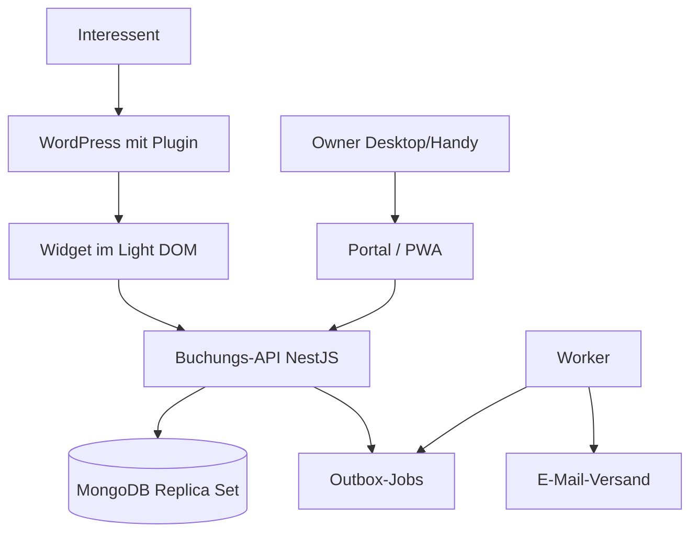

# Architektur

Eigenständige Buchungsanwendung mit API und MongoDB. WordPress bindet nur das öffentliche Widget ein; Owner arbeiten in einem eigenen Verwaltungsportal, das zugleich als PWA installierbar ist. Je Kunde eine getrennte Installation mit eigener Datenbank, gemeinsamer versionierter Code.



## Repository-Struktur

```
apps/api          Buchungsregeln, Auth, REST
apps/worker       Outbox, Leases, E-Mail
apps/portal       Owner-Portal und PWA
packages/shared   Domänentypen, Validierung, Zeitzonen
packages/widget   Öffentliches Widget
plugins/wordpress PHP-Plugin
infra/            docker-compose (MongoDB, Mailpit)
```

## Terminarten

| | Einzeltermin | Gruppenkurs |
|---|---|---|
| Owner pflegt | Öffnungszeiten, Ausnahmen, Dauer, Puffer | Kurstermine bzw. wiederkehrende Regeln mit Kapazität |
| Interessent sieht | Tag → freie Uhrzeiten | Kurstermine mit freien Plätzen |
| Kapazität | 1 | > 1 |
| Schutz vor Doppelbuchung | Belegungseinheiten der Ressource mit eindeutigem Index | Atomare Kapazitätsprüfung in der Schreibbedingung |

Kurse blockieren die Ressource ebenfalls, sodass Einzeltermine sich nicht mit Kursen überschneiden.

## Collections

`settings`, `owners`, `services`, `openingHours`, `availabilityExceptions`, `courseRules`, `sessions`, `bookings`, `resourceOccupancy`, `actionTokens`, `outboxJobs`, `auditEvents` sowie `_migrations` für angewendete Migrationen.

Dokumenttypen: `apps/api/src/database/documents.ts`. Zeitpunkte sind BSON-Dates in UTC. Struktur, Validatoren und Indizes entstehen über versionierte Migrationen in `apps/api/src/database/migrations/` und werden mit `pnpm --filter @fw-booking/api db:migrate` angewendet (nicht beim API-Start).

| Schutz | Umsetzung |
|---|---|
| Keine Doppelbelegung der Ressource | Eindeutiger Index `resourceOccupancy(resourceId, unitStart)`; Validator erzwingt 5-Minuten-Raster |
| Keine Überbuchung eines Kurses | Validator `bookedCount ≤ capacity` auf `sessions` |
| Keine doppelte Buchung bei Wiederholung | Eindeutiger Index `bookings(idempotencyKey)` |
| Eine aktive Buchung je E-Mail und Kurstermin | Eindeutiger Teilindex `bookings(sessionId, participantEmailKey)` für `status: confirmed` |
| Idempotente Kurstermin-Erzeugung | Eindeutiger Teilindex `sessions(ruleId, localStart)` |
| Tokens nur als Hash | Validator verlangt SHA-256-Hex in `actionTokens.tokenHash` |

## Owner-Anmeldung

| Endpunkt | Wirkung |
|---|---|
| `POST /api/auth/login` | Prüft E-Mail und Passwort (Argon2id), legt Sitzung an, setzt Cookie, liefert CSRF-Token |
| `GET /api/auth/session` | Aktuelle Sitzung mit CSRF-Token oder 401 |
| `POST /api/auth/logout` | Löscht Sitzung und Cookie |

- **Standardmäßig gesperrt:** Ein globaler Guard verlangt für jede Route eine Owner-Sitzung; öffentliche Routen werden mit `@Public()` freigegeben.
- **Sitzung:** Zufallstoken (256 Bit) im Cookie `__Host-fw_session` (lokal `fw_session`), `HttpOnly`, `Secure`, `SameSite=Lax`. In `authSessions` liegt nur der SHA-256-Hash. 12 h Inaktivität, maximal 7 Tage; neue Sitzung bei jedem Login.
- **CSRF:** Ändernde Anfragen brauchen `Content-Type: application/json` und den Header `X-CSRF-Token` der Sitzung.
- **Passwort-Raten:** Nach 5 Fehlversuchen in 15 Minuten je E-Mail oder IP antwortet der Login mit 429. Unbekannte E-Mails und falsche Passwörter sind von außen nicht unterscheidbar.
- **Konten:** Keine Selbstregistrierung; Anlage per `owner:create` (Passwort ≥ 12 Zeichen, verdeckte Eingabe).

## Zentrale Abnahmetests

- Parallele Anfragen auf denselben Einzeltermin-Slot → genau eine Buchung.
- Kurs mit N Plätzen → bei parallelen Anfragen genau N Buchungen.
- Gleicher Idempotenzschlüssel → keine zweite Buchung.
- Mehrfaches Storno gibt Plätze nur einmal frei; fehlgeschlagene Umbuchung erhält die ursprüngliche Buchung.
- Längere Einzeltermine blockieren alle überlappenden Slots, auch anderer Angebote; Kurse blockieren Einzeltermine.
- Sommer-/Winterzeit wird korrekt behandelt.
- Ausfall des E-Mail-Dienstes verliert keine Buchung.
- Nach Logout keine Teilnehmerdaten abrufbar oder im Service-Worker-Cache.
- Zugangsdaten einer Installation eröffnen keinen Zugriff auf eine andere.
- Backups lassen sich wiederherstellen.

Ausführliche Herleitung: `Architektur-Terminbuchung.md` (Ausgangsdokument außerhalb des Repositorys).
