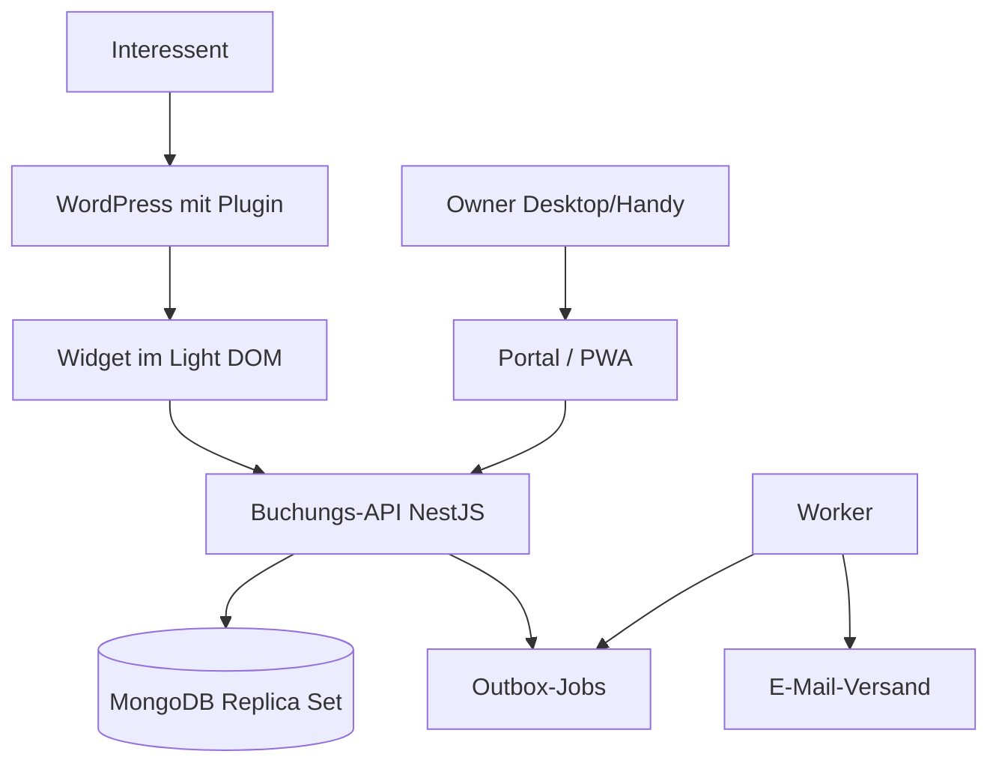

# Architektur

Eigenständige Buchungsanwendung mit API und MongoDB. WordPress bindet nur das öffentliche Widget ein; Owner arbeiten in einem eigenen Verwaltungsportal, das zugleich als PWA installierbar ist. Je Kunde eine getrennte Installation mit eigener Datenbank, gemeinsamer versionierter Code.



## Repository-Struktur

```
apps/api          Buchungsregeln, Auth, REST
apps/worker       Outbox, Leases, E-Mail
apps/portal       Owner-Portal und PWA
packages/shared   Domänentypen, Validierung, Zeitzonen
packages/widget   Öffentliches Widget
plugins/wordpress PHP-Plugin
infra/            docker-compose (MongoDB, Mailpit)
```

## Terminarten

| | Einzeltermin | Gruppenkurs |
|---|---|---|
| Owner pflegt | Öffnungszeiten, Ausnahmen, Dauer, Puffer | Kurstermine bzw. wiederkehrende Regeln mit Kapazität |
| Interessent sieht | Tag → freie Uhrzeiten | Kurstermine mit freien Plätzen |
| Kapazität | 1 | > 1 |
| Schutz vor Doppelbuchung | Belegungseinheiten der Ressource mit eindeutigem Index | Atomare Kapazitätsprüfung in der Schreibbedingung |

Kurse blockieren die Ressource ebenfalls, sodass Einzeltermine sich nicht mit Kursen überschneiden.

## Collections

`owners`, `services`, `availabilityRules`, `availabilityExceptions`, `sessions`, `bookings`, `resourceOccupancy`, `actionTokens`, `outboxJobs`, `auditEvents`.

## Zentrale Abnahmetests

- Parallele Anfragen auf denselben Einzeltermin-Slot → genau eine Buchung.
- Kurs mit N Plätzen → bei parallelen Anfragen genau N Buchungen.
- Gleicher Idempotenzschlüssel → keine zweite Buchung.
- Mehrfaches Storno gibt Plätze nur einmal frei; fehlgeschlagene Umbuchung erhält die ursprüngliche Buchung.
- Längere Einzeltermine blockieren alle überlappenden Slots, auch anderer Angebote; Kurse blockieren Einzeltermine.
- Sommer-/Winterzeit wird korrekt behandelt.
- Ausfall des E-Mail-Dienstes verliert keine Buchung.
- Nach Logout keine Teilnehmerdaten abrufbar oder im Service-Worker-Cache.
- Zugangsdaten einer Installation eröffnen keinen Zugriff auf eine andere.
- Backups lassen sich wiederherstellen.

Ausführliche Herleitung: `Architektur-Terminbuchung.md` (Ausgangsdokument außerhalb des Repositorys).
